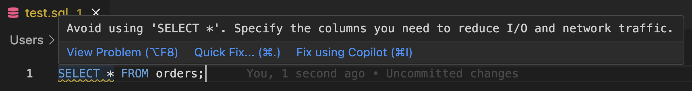
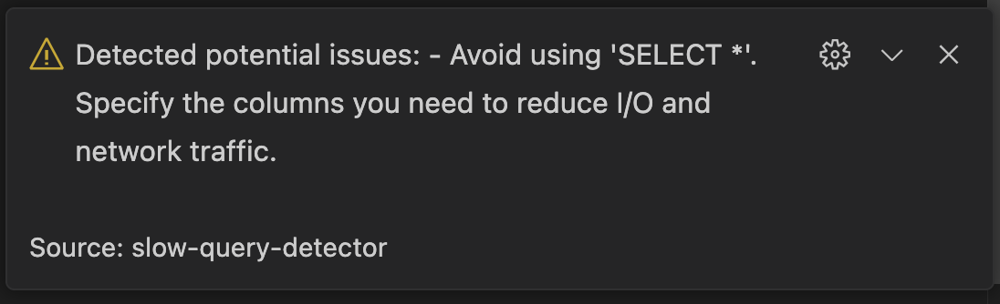
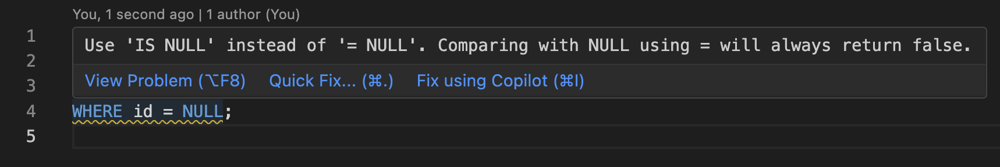
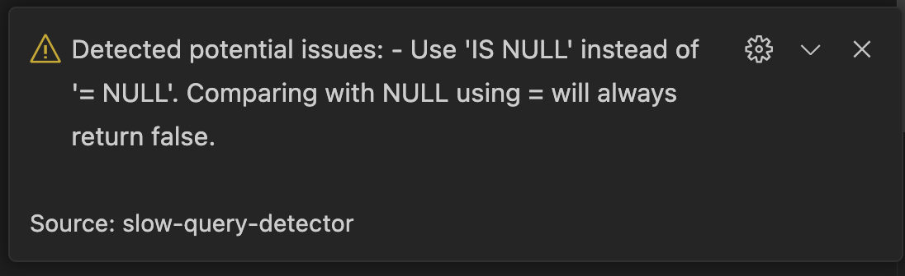

# slow-query-detector

Slow Query detector is a VS Code extension that helps you detect slow SQL queries in your codebase.

## Features

- Detect slow SQL queries in your codebase.
- Provide suggestions to improve the performance of your SQL queries.

## How to use

1. Open the command palette (Ctrl+Shift+P) and select "Slow Query Detector: Detect Slow Queries".
2. The extension will analyze your codebase and detect slow SQL queries.
3. The extension will provide suggestions to improve the performance of your SQL queries.

## How it works

The extension uses a simple heuristic to detect slow SQL queries. It looks for patterns in the SQL queries that are known to be slow.

## Screenshots

